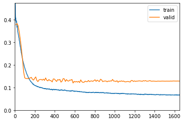

# Setup


```python
!pip install fastai -U 
```

    Collecting fastai
      Downloading fastai-2.0.9-py3-none-any.whl (354 kB)
         |████████████████████████████████| 354 kB 606 kB/s eta 0:00:01
    [?25hRequirement already satisfied, skipping upgrade: packaging in /opt/conda/lib/python3.7/site-packages (from fastai) (20.1)
    Requirement already satisfied, skipping upgrade: scikit-learn in /opt/conda/lib/python3.7/site-packages (from fastai) (0.23.2)
    Requirement already satisfied, skipping upgrade: matplotlib in /opt/conda/lib/python3.7/site-packages (from fastai) (3.2.1)
    Requirement already satisfied, skipping upgrade: pandas in /opt/conda/lib/python3.7/site-packages (from fastai) (1.1.1)
    Collecting fastcore>=1.0.2
      Downloading fastcore-1.0.4-py3-none-any.whl (37 kB)
    Requirement already satisfied, skipping upgrade: pip in /opt/conda/lib/python3.7/site-packages (from fastai) (20.2.2)
    Requirement already satisfied, skipping upgrade: fastprogress>=0.2.4 in /opt/conda/lib/python3.7/site-packages (from fastai) (1.0.0)
    Requirement already satisfied, skipping upgrade: requests in /opt/conda/lib/python3.7/site-packages (from fastai) (2.23.0)
    Collecting torch>=1.6.0
      Downloading torch-1.6.0-cp37-cp37m-manylinux1_x86_64.whl (748.8 MB)
         |████████████████████████████████| 748.8 MB 12 kB/s s eta 0:00:01    |██                              | 46.2 MB 26.8 MB/s eta 0:00:27     |█████████████▎                  | 309.9 MB 42.0 MB/s eta 0:00:11MB/s eta 0:00:04��████████████████████████▉   | 674.7 MB 46.3 MB/s eta 0:00:02
    [?25hRequirement already satisfied, skipping upgrade: scipy in /opt/conda/lib/python3.7/site-packages (from fastai) (1.4.1)
    Requirement already satisfied, skipping upgrade: pyyaml in /opt/conda/lib/python3.7/site-packages (from fastai) (5.3.1)
    Requirement already satisfied, skipping upgrade: pillow in /opt/conda/lib/python3.7/site-packages (from fastai) (7.2.0)
    Requirement already satisfied, skipping upgrade: spacy in /opt/conda/lib/python3.7/site-packages (from fastai) (2.2.4)
    Collecting torchvision>=0.7
      Downloading torchvision-0.7.0-cp37-cp37m-manylinux1_x86_64.whl (5.9 MB)
         |████████████████████████████████| 5.9 MB 67.5 MB/s eta 0:00:01
    [?25hRequirement already satisfied, skipping upgrade: six in /opt/conda/lib/python3.7/site-packages (from packaging->fastai) (1.14.0)
    Requirement already satisfied, skipping upgrade: pyparsing>=2.0.2 in /opt/conda/lib/python3.7/site-packages (from packaging->fastai) (2.4.7)
    Requirement already satisfied, skipping upgrade: threadpoolctl>=2.0.0 in /opt/conda/lib/python3.7/site-packages (from scikit-learn->fastai) (2.1.0)
    Requirement already satisfied, skipping upgrade: numpy>=1.13.3 in /opt/conda/lib/python3.7/site-packages (from scikit-learn->fastai) (1.18.5)
    Requirement already satisfied, skipping upgrade: joblib>=0.11 in /opt/conda/lib/python3.7/site-packages (from scikit-learn->fastai) (0.14.1)
    Requirement already satisfied, skipping upgrade: kiwisolver>=1.0.1 in /opt/conda/lib/python3.7/site-packages (from matplotlib->fastai) (1.2.0)
    Requirement already satisfied, skipping upgrade: cycler>=0.10 in /opt/conda/lib/python3.7/site-packages (from matplotlib->fastai) (0.10.0)
    Requirement already satisfied, skipping upgrade: python-dateutil>=2.1 in /opt/conda/lib/python3.7/site-packages (from matplotlib->fastai) (2.8.1)
    Requirement already satisfied, skipping upgrade: pytz>=2017.2 in /opt/conda/lib/python3.7/site-packages (from pandas->fastai) (2019.3)
    Collecting dataclasses
      Downloading dataclasses-0.6-py3-none-any.whl (14 kB)
    Requirement already satisfied, skipping upgrade: idna<3,>=2.5 in /opt/conda/lib/python3.7/site-packages (from requests->fastai) (2.9)
    Requirement already satisfied, skipping upgrade: chardet<4,>=3.0.2 in /opt/conda/lib/python3.7/site-packages (from requests->fastai) (3.0.4)
    Requirement already satisfied, skipping upgrade: certifi>=2017.4.17 in /opt/conda/lib/python3.7/site-packages (from requests->fastai) (2020.6.20)
    Requirement already satisfied, skipping upgrade: urllib3!=1.25.0,!=1.25.1,<1.26,>=1.21.1 in /opt/conda/lib/python3.7/site-packages (from requests->fastai) (1.24.3)
    Requirement already satisfied, skipping upgrade: future in /opt/conda/lib/python3.7/site-packages (from torch>=1.6.0->fastai) (0.18.2)
    Requirement already satisfied, skipping upgrade: catalogue<1.1.0,>=0.0.7 in /opt/conda/lib/python3.7/site-packages (from spacy->fastai) (1.0.0)
    Requirement already satisfied, skipping upgrade: srsly<1.1.0,>=1.0.2 in /opt/conda/lib/python3.7/site-packages (from spacy->fastai) (1.0.2)
    Requirement already satisfied, skipping upgrade: cymem<2.1.0,>=2.0.2 in /opt/conda/lib/python3.7/site-packages (from spacy->fastai) (2.0.3)
    Requirement already satisfied, skipping upgrade: preshed<3.1.0,>=3.0.2 in /opt/conda/lib/python3.7/site-packages (from spacy->fastai) (3.0.2)
    Requirement already satisfied, skipping upgrade: tqdm<5.0.0,>=4.38.0 in /opt/conda/lib/python3.7/site-packages (from spacy->fastai) (4.45.0)
    Requirement already satisfied, skipping upgrade: thinc==7.4.0 in /opt/conda/lib/python3.7/site-packages (from spacy->fastai) (7.4.0)
    Requirement already satisfied, skipping upgrade: setuptools in /opt/conda/lib/python3.7/site-packages (from spacy->fastai) (46.1.3.post20200325)
    Requirement already satisfied, skipping upgrade: wasabi<1.1.0,>=0.4.0 in /opt/conda/lib/python3.7/site-packages (from spacy->fastai) (0.7.1)
    Requirement already satisfied, skipping upgrade: plac<1.2.0,>=0.9.6 in /opt/conda/lib/python3.7/site-packages (from spacy->fastai) (1.1.3)
    Requirement already satisfied, skipping upgrade: murmurhash<1.1.0,>=0.28.0 in /opt/conda/lib/python3.7/site-packages (from spacy->fastai) (1.0.2)
    Requirement already satisfied, skipping upgrade: blis<0.5.0,>=0.4.0 in /opt/conda/lib/python3.7/site-packages (from spacy->fastai) (0.4.1)
    Requirement already satisfied, skipping upgrade: importlib-metadata>=0.20; python_version < "3.8" in /opt/conda/lib/python3.7/site-packages (from catalogue<1.1.0,>=0.0.7->spacy->fastai) (1.6.0)
    Requirement already satisfied, skipping upgrade: zipp>=0.5 in /opt/conda/lib/python3.7/site-packages (from importlib-metadata>=0.20; python_version < "3.8"->catalogue<1.1.0,>=0.0.7->spacy->fastai) (3.1.0)
    Installing collected packages: dataclasses, fastcore, torch, torchvision, fastai
      Attempting uninstall: torch
        Found existing installation: torch 1.5.1
        Uninstalling torch-1.5.1:
          Successfully uninstalled torch-1.5.1
      Attempting uninstall: torchvision
        Found existing installation: torchvision 0.6.0a0+35d732a
        Uninstalling torchvision-0.6.0a0+35d732a:
          Successfully uninstalled torchvision-0.6.0a0+35d732a
      Attempting uninstall: fastai
        Found existing installation: fastai 1.0.61
        Uninstalling fastai-1.0.61:
          Successfully uninstalled fastai-1.0.61
    ERROR: After October 2020 you may experience errors when installing or updating packages. This is because pip will change the way that it resolves dependency conflicts.
    
    We recommend you use --use-feature=2020-resolver to test your packages with the new resolver before it becomes the default.
    
    kornia 0.3.2 requires torch<1.6.0,>=1.5.0, but you'll have torch 1.6.0 which is incompatible.
    allennlp 1.0.0 requires torch<1.6.0,>=1.5.0, but you'll have torch 1.6.0 which is incompatible.
    Successfully installed dataclasses-0.6 fastai-2.0.9 fastcore-1.0.4 torch-1.6.0 torchvision-0.7.0


```python
import fastai
```


```python
fastai.__version__
```


    '2.0.9'


```python
from fastai.tabular.all import *
```

# Data


```python
path = '../input/titanic'
train_path = path + '/train.csv'
test_path = path + '/test.csv'
```


```python
train = pd.read_csv(train_path)
train.head()
```


<div>
<style scoped>
    .dataframe tbody tr th:only-of-type {
        vertical-align: middle;
    }

    .dataframe tbody tr th {
        vertical-align: top;
    }

    .dataframe thead th {
        text-align: right;
    }
</style>
<table border="1" class="dataframe">
  <thead>
    <tr style="text-align: right;">
      <th></th>
      <th>PassengerId</th>
      <th>Survived</th>
      <th>Pclass</th>
      <th>Name</th>
      <th>Sex</th>
      <th>Age</th>
      <th>SibSp</th>
      <th>Parch</th>
      <th>Ticket</th>
      <th>Fare</th>
      <th>Cabin</th>
      <th>Embarked</th>
    </tr>
  </thead>
  <tbody>
    <tr>
      <th>0</th>
      <td>1</td>
      <td>0</td>
      <td>3</td>
      <td>Braund, Mr. Owen Harris</td>
      <td>male</td>
      <td>22.0</td>
      <td>1</td>
      <td>0</td>
      <td>A/5 21171</td>
      <td>7.2500</td>
      <td>NaN</td>
      <td>S</td>
    </tr>
    <tr>
      <th>1</th>
      <td>2</td>
      <td>1</td>
      <td>1</td>
      <td>Cumings, Mrs. John Bradley (Florence Briggs Thayer)</td>
      <td>female</td>
      <td>38.0</td>
      <td>1</td>
      <td>0</td>
      <td>PC 17599</td>
      <td>71.2833</td>
      <td>C85</td>
      <td>C</td>
    </tr>
    <tr>
      <th>2</th>
      <td>3</td>
      <td>1</td>
      <td>3</td>
      <td>Heikkinen, Miss. Laina</td>
      <td>female</td>
      <td>26.0</td>
      <td>0</td>
      <td>0</td>
      <td>STON/O2. 3101282</td>
      <td>7.9250</td>
      <td>NaN</td>
      <td>S</td>
    </tr>
    <tr>
      <th>3</th>
      <td>4</td>
      <td>1</td>
      <td>1</td>
      <td>Futrelle, Mrs. Jacques Heath (Lily May Peel)</td>
      <td>female</td>
      <td>35.0</td>
      <td>1</td>
      <td>0</td>
      <td>113803</td>
      <td>53.1000</td>
      <td>C123</td>
      <td>S</td>
    </tr>
    <tr>
      <th>4</th>
      <td>5</td>
      <td>0</td>
      <td>3</td>
      <td>Allen, Mr. William Henry</td>
      <td>male</td>
      <td>35.0</td>
      <td>0</td>
      <td>0</td>
      <td>373450</td>
      <td>8.0500</td>
      <td>NaN</td>
      <td>S</td>
    </tr>
  </tbody>
</table>
</div>


```python
train.Parch.describe()
```


    count    891.000000
    mean       0.381594
    std        0.806057
    min        0.000000
    25%        0.000000
    50%        0.000000
    75%        0.000000
    max        6.000000
    Name: Parch, dtype: float64


```python
train.columns
```


    Index(['PassengerId', 'Survived', 'Pclass', 'Name', 'Sex', 'Age', 'SibSp',
           'Parch', 'Ticket', 'Fare', 'Cabin', 'Embarked'],
          dtype='object')


```python
splits = RandomSplitter(valid_pct=0.2)(range_of(train))
```


```python
data = TabularPandas(
    train,
    procs=[Categorify, FillMissing,Normalize],
    cat_names = ['Pclass', 'SibSp', 'Sex', 'Parch','Cabin','Embarked'],
    cont_names = ['Age','Fare'],
    y_names='Survived',
    splits=splits)
```

# Train


```python
dls = data.dataloaders(bs=64)
```


```python
learn = tabular_learner(dls, metrics=accuracy, cbs=ShowGraphCallback())
```


```python
learn.fit_one_cycle(150)
```


<table border="1" class="dataframe">
  <thead>
    <tr style="text-align: left;">
      <th>epoch</th>
      <th>train_loss</th>
      <th>valid_loss</th>
      <th>accuracy</th>
      <th>time</th>
    </tr>
  </thead>
  <tbody>
    <tr>
      <td>0</td>
      <td>0.395150</td>
      <td>0.377600</td>
      <td>0.702247</td>
      <td>00:00</td>
    </tr>
    <tr>
      <td>1</td>
      <td>0.366346</td>
      <td>0.382785</td>
      <td>0.702247</td>
      <td>00:00</td>
    </tr>
    <tr>
      <td>2</td>
      <td>0.339551</td>
      <td>0.371797</td>
      <td>0.702247</td>
      <td>00:00</td>
    </tr>
    <tr>
      <td>3</td>
      <td>0.310264</td>
      <td>0.345113</td>
      <td>0.702247</td>
      <td>00:00</td>
    </tr>
    <tr>
      <td>4</td>
      <td>0.281579</td>
      <td>0.310483</td>
      <td>0.702247</td>
      <td>00:00</td>
    </tr>
    <tr>
      <td>5</td>
      <td>0.253278</td>
      <td>0.269912</td>
      <td>0.702247</td>
      <td>00:00</td>
    </tr>
    <tr>
      <td>6</td>
      <td>0.228688</td>
      <td>0.222490</td>
      <td>0.702247</td>
      <td>00:00</td>
    </tr>
    <tr>
      <td>7</td>
      <td>0.206920</td>
      <td>0.168250</td>
      <td>0.702247</td>
      <td>00:00</td>
    </tr>
    <tr>
      <td>8</td>
      <td>0.187758</td>
      <td>0.142423</td>
      <td>0.702247</td>
      <td>00:00</td>
    </tr>
    <tr>
      <td>9</td>
      <td>0.173925</td>
      <td>0.139804</td>
      <td>0.702247</td>
      <td>00:00</td>
    </tr>
    <tr>
      <td>10</td>
      <td>0.159615</td>
      <td>0.139614</td>
      <td>0.702247</td>
      <td>00:00</td>
    </tr>
    <tr>
      <td>11</td>
      <td>0.148577</td>
      <td>0.139325</td>
      <td>0.702247</td>
      <td>00:00</td>
    </tr>
    <tr>
      <td>12</td>
      <td>0.138739</td>
      <td>0.140137</td>
      <td>0.702247</td>
      <td>00:00</td>
    </tr>
    <tr>
      <td>13</td>
      <td>0.130475</td>
      <td>0.142085</td>
      <td>0.702247</td>
      <td>00:00</td>
    </tr>
    <tr>
      <td>14</td>
      <td>0.124002</td>
      <td>0.144857</td>
      <td>0.702247</td>
      <td>00:00</td>
    </tr>
    <tr>
      <td>15</td>
      <td>0.118234</td>
      <td>0.136231</td>
      <td>0.702247</td>
      <td>00:00</td>
    </tr>
    <tr>
      <td>16</td>
      <td>0.114288</td>
      <td>0.132554</td>
      <td>0.702247</td>
      <td>00:00</td>
    </tr>
    <tr>
      <td>17</td>
      <td>0.110318</td>
      <td>0.140191</td>
      <td>0.702247</td>
      <td>00:00</td>
    </tr>
    <tr>
      <td>18</td>
      <td>0.107971</td>
      <td>0.146698</td>
      <td>0.702247</td>
      <td>00:00</td>
    </tr>
    <tr>
      <td>19</td>
      <td>0.106027</td>
      <td>0.131402</td>
      <td>0.702247</td>
      <td>00:00</td>
    </tr>
    <tr>
      <td>20</td>
      <td>0.104463</td>
      <td>0.125868</td>
      <td>0.702247</td>
      <td>00:00</td>
    </tr>
    <tr>
      <td>21</td>
      <td>0.101879</td>
      <td>0.133761</td>
      <td>0.702247</td>
      <td>00:00</td>
    </tr>
    <tr>
      <td>22</td>
      <td>0.101234</td>
      <td>0.135055</td>
      <td>0.702247</td>
      <td>00:00</td>
    </tr>
    <tr>
      <td>23</td>
      <td>0.099686</td>
      <td>0.135643</td>
      <td>0.702247</td>
      <td>00:00</td>
    </tr>
    <tr>
      <td>24</td>
      <td>0.098142</td>
      <td>0.132391</td>
      <td>0.702247</td>
      <td>00:00</td>
    </tr>
    <tr>
      <td>25</td>
      <td>0.096319</td>
      <td>0.136855</td>
      <td>0.702247</td>
      <td>00:00</td>
    </tr>
    <tr>
      <td>26</td>
      <td>0.095436</td>
      <td>0.131195</td>
      <td>0.702247</td>
      <td>00:00</td>
    </tr>
    <tr>
      <td>27</td>
      <td>0.094448</td>
      <td>0.142192</td>
      <td>0.702247</td>
      <td>00:00</td>
    </tr>
    <tr>
      <td>28</td>
      <td>0.093358</td>
      <td>0.132326</td>
      <td>0.702247</td>
      <td>00:00</td>
    </tr>
    <tr>
      <td>29</td>
      <td>0.093689</td>
      <td>0.129051</td>
      <td>0.702247</td>
      <td>00:00</td>
    </tr>
    <tr>
      <td>30</td>
      <td>0.092883</td>
      <td>0.135105</td>
      <td>0.702247</td>
      <td>00:00</td>
    </tr>
    <tr>
      <td>31</td>
      <td>0.092068</td>
      <td>0.130766</td>
      <td>0.702247</td>
      <td>00:00</td>
    </tr>
    <tr>
      <td>32</td>
      <td>0.091736</td>
      <td>0.129940</td>
      <td>0.702247</td>
      <td>00:00</td>
    </tr>
    <tr>
      <td>33</td>
      <td>0.091531</td>
      <td>0.124503</td>
      <td>0.702247</td>
      <td>00:00</td>
    </tr>
    <tr>
      <td>34</td>
      <td>0.091348</td>
      <td>0.137747</td>
      <td>0.702247</td>
      <td>00:00</td>
    </tr>
    <tr>
      <td>35</td>
      <td>0.091168</td>
      <td>0.137324</td>
      <td>0.702247</td>
      <td>00:00</td>
    </tr>
    <tr>
      <td>36</td>
      <td>0.090646</td>
      <td>0.131917</td>
      <td>0.702247</td>
      <td>00:00</td>
    </tr>
    <tr>
      <td>37</td>
      <td>0.090659</td>
      <td>0.126318</td>
      <td>0.702247</td>
      <td>00:00</td>
    </tr>
    <tr>
      <td>38</td>
      <td>0.089957</td>
      <td>0.135028</td>
      <td>0.702247</td>
      <td>00:00</td>
    </tr>
    <tr>
      <td>39</td>
      <td>0.088891</td>
      <td>0.132661</td>
      <td>0.702247</td>
      <td>00:00</td>
    </tr>
    <tr>
      <td>40</td>
      <td>0.088472</td>
      <td>0.135807</td>
      <td>0.702247</td>
      <td>00:00</td>
    </tr>
    <tr>
      <td>41</td>
      <td>0.089196</td>
      <td>0.123606</td>
      <td>0.702247</td>
      <td>00:00</td>
    </tr>
    <tr>
      <td>42</td>
      <td>0.088436</td>
      <td>0.128096</td>
      <td>0.702247</td>
      <td>00:00</td>
    </tr>
    <tr>
      <td>43</td>
      <td>0.087570</td>
      <td>0.139201</td>
      <td>0.702247</td>
      <td>00:00</td>
    </tr>
    <tr>
      <td>44</td>
      <td>0.087807</td>
      <td>0.138244</td>
      <td>0.702247</td>
      <td>00:00</td>
    </tr>
    <tr>
      <td>45</td>
      <td>0.087348</td>
      <td>0.126612</td>
      <td>0.702247</td>
      <td>00:00</td>
    </tr>
    <tr>
      <td>46</td>
      <td>0.086900</td>
      <td>0.134935</td>
      <td>0.702247</td>
      <td>00:00</td>
    </tr>
    <tr>
      <td>47</td>
      <td>0.085824</td>
      <td>0.129363</td>
      <td>0.702247</td>
      <td>00:00</td>
    </tr>
    <tr>
      <td>48</td>
      <td>0.085647</td>
      <td>0.128131</td>
      <td>0.702247</td>
      <td>00:00</td>
    </tr>
    <tr>
      <td>49</td>
      <td>0.084996</td>
      <td>0.132883</td>
      <td>0.702247</td>
      <td>00:00</td>
    </tr>
    <tr>
      <td>50</td>
      <td>0.084723</td>
      <td>0.132393</td>
      <td>0.702247</td>
      <td>00:00</td>
    </tr>
    <tr>
      <td>51</td>
      <td>0.085479</td>
      <td>0.135473</td>
      <td>0.702247</td>
      <td>00:00</td>
    </tr>
    <tr>
      <td>52</td>
      <td>0.085324</td>
      <td>0.119682</td>
      <td>0.702247</td>
      <td>00:00</td>
    </tr>
    <tr>
      <td>53</td>
      <td>0.084677</td>
      <td>0.127057</td>
      <td>0.702247</td>
      <td>00:00</td>
    </tr>
    <tr>
      <td>54</td>
      <td>0.083926</td>
      <td>0.124037</td>
      <td>0.702247</td>
      <td>00:00</td>
    </tr>
    <tr>
      <td>55</td>
      <td>0.083732</td>
      <td>0.126720</td>
      <td>0.702247</td>
      <td>00:00</td>
    </tr>
    <tr>
      <td>56</td>
      <td>0.083126</td>
      <td>0.123772</td>
      <td>0.702247</td>
      <td>00:00</td>
    </tr>
    <tr>
      <td>57</td>
      <td>0.082183</td>
      <td>0.127085</td>
      <td>0.702247</td>
      <td>00:00</td>
    </tr>
    <tr>
      <td>58</td>
      <td>0.081710</td>
      <td>0.121816</td>
      <td>0.702247</td>
      <td>00:00</td>
    </tr>
    <tr>
      <td>59</td>
      <td>0.081324</td>
      <td>0.133650</td>
      <td>0.702247</td>
      <td>00:00</td>
    </tr>
    <tr>
      <td>60</td>
      <td>0.080935</td>
      <td>0.125411</td>
      <td>0.702247</td>
      <td>00:00</td>
    </tr>
    <tr>
      <td>61</td>
      <td>0.079854</td>
      <td>0.122429</td>
      <td>0.702247</td>
      <td>00:00</td>
    </tr>
    <tr>
      <td>62</td>
      <td>0.079330</td>
      <td>0.123147</td>
      <td>0.702247</td>
      <td>00:00</td>
    </tr>
    <tr>
      <td>63</td>
      <td>0.078994</td>
      <td>0.127851</td>
      <td>0.702247</td>
      <td>00:00</td>
    </tr>
    <tr>
      <td>64</td>
      <td>0.078510</td>
      <td>0.125835</td>
      <td>0.702247</td>
      <td>00:00</td>
    </tr>
    <tr>
      <td>65</td>
      <td>0.078242</td>
      <td>0.125809</td>
      <td>0.702247</td>
      <td>00:00</td>
    </tr>
    <tr>
      <td>66</td>
      <td>0.078397</td>
      <td>0.130970</td>
      <td>0.702247</td>
      <td>00:00</td>
    </tr>
    <tr>
      <td>67</td>
      <td>0.078568</td>
      <td>0.125747</td>
      <td>0.702247</td>
      <td>00:00</td>
    </tr>
    <tr>
      <td>68</td>
      <td>0.078034</td>
      <td>0.128503</td>
      <td>0.702247</td>
      <td>00:00</td>
    </tr>
    <tr>
      <td>69</td>
      <td>0.077501</td>
      <td>0.128943</td>
      <td>0.702247</td>
      <td>00:00</td>
    </tr>
    <tr>
      <td>70</td>
      <td>0.078080</td>
      <td>0.127008</td>
      <td>0.702247</td>
      <td>00:00</td>
    </tr>
    <tr>
      <td>71</td>
      <td>0.078011</td>
      <td>0.130303</td>
      <td>0.702247</td>
      <td>00:00</td>
    </tr>
    <tr>
      <td>72</td>
      <td>0.078300</td>
      <td>0.134184</td>
      <td>0.702247</td>
      <td>00:00</td>
    </tr>
    <tr>
      <td>73</td>
      <td>0.078497</td>
      <td>0.126999</td>
      <td>0.702247</td>
      <td>00:00</td>
    </tr>
    <tr>
      <td>74</td>
      <td>0.077963</td>
      <td>0.132503</td>
      <td>0.702247</td>
      <td>00:00</td>
    </tr>
    <tr>
      <td>75</td>
      <td>0.077654</td>
      <td>0.128828</td>
      <td>0.702247</td>
      <td>00:00</td>
    </tr>
    <tr>
      <td>76</td>
      <td>0.077370</td>
      <td>0.126126</td>
      <td>0.702247</td>
      <td>00:00</td>
    </tr>
    <tr>
      <td>77</td>
      <td>0.077282</td>
      <td>0.136550</td>
      <td>0.702247</td>
      <td>00:00</td>
    </tr>
    <tr>
      <td>78</td>
      <td>0.077126</td>
      <td>0.133494</td>
      <td>0.702247</td>
      <td>00:00</td>
    </tr>
    <tr>
      <td>79</td>
      <td>0.077159</td>
      <td>0.125807</td>
      <td>0.702247</td>
      <td>00:00</td>
    </tr>
    <tr>
      <td>80</td>
      <td>0.076400</td>
      <td>0.127987</td>
      <td>0.702247</td>
      <td>00:00</td>
    </tr>
    <tr>
      <td>81</td>
      <td>0.076187</td>
      <td>0.128587</td>
      <td>0.702247</td>
      <td>00:00</td>
    </tr>
    <tr>
      <td>82</td>
      <td>0.076069</td>
      <td>0.128721</td>
      <td>0.702247</td>
      <td>00:00</td>
    </tr>
    <tr>
      <td>83</td>
      <td>0.076213</td>
      <td>0.125016</td>
      <td>0.702247</td>
      <td>00:00</td>
    </tr>
    <tr>
      <td>84</td>
      <td>0.075244</td>
      <td>0.128486</td>
      <td>0.702247</td>
      <td>00:00</td>
    </tr>
    <tr>
      <td>85</td>
      <td>0.075067</td>
      <td>0.127430</td>
      <td>0.702247</td>
      <td>00:00</td>
    </tr>
    <tr>
      <td>86</td>
      <td>0.074768</td>
      <td>0.129118</td>
      <td>0.702247</td>
      <td>00:00</td>
    </tr>
    <tr>
      <td>87</td>
      <td>0.074301</td>
      <td>0.128410</td>
      <td>0.702247</td>
      <td>00:00</td>
    </tr>
    <tr>
      <td>88</td>
      <td>0.074128</td>
      <td>0.135739</td>
      <td>0.702247</td>
      <td>00:00</td>
    </tr>
    <tr>
      <td>89</td>
      <td>0.074148</td>
      <td>0.128045</td>
      <td>0.702247</td>
      <td>00:00</td>
    </tr>
    <tr>
      <td>90</td>
      <td>0.073939</td>
      <td>0.128453</td>
      <td>0.702247</td>
      <td>00:00</td>
    </tr>
    <tr>
      <td>91</td>
      <td>0.073921</td>
      <td>0.126086</td>
      <td>0.702247</td>
      <td>00:00</td>
    </tr>
    <tr>
      <td>92</td>
      <td>0.074096</td>
      <td>0.130053</td>
      <td>0.702247</td>
      <td>00:00</td>
    </tr>
    <tr>
      <td>93</td>
      <td>0.073546</td>
      <td>0.122949</td>
      <td>0.702247</td>
      <td>00:00</td>
    </tr>
    <tr>
      <td>94</td>
      <td>0.073346</td>
      <td>0.128125</td>
      <td>0.702247</td>
      <td>00:00</td>
    </tr>
    <tr>
      <td>95</td>
      <td>0.073310</td>
      <td>0.126533</td>
      <td>0.702247</td>
      <td>00:00</td>
    </tr>
    <tr>
      <td>96</td>
      <td>0.073573</td>
      <td>0.129317</td>
      <td>0.702247</td>
      <td>00:00</td>
    </tr>
    <tr>
      <td>97</td>
      <td>0.073582</td>
      <td>0.126800</td>
      <td>0.702247</td>
      <td>00:00</td>
    </tr>
    <tr>
      <td>98</td>
      <td>0.073473</td>
      <td>0.128594</td>
      <td>0.702247</td>
      <td>00:00</td>
    </tr>
    <tr>
      <td>99</td>
      <td>0.073284</td>
      <td>0.125200</td>
      <td>0.702247</td>
      <td>00:00</td>
    </tr>
    <tr>
      <td>100</td>
      <td>0.072751</td>
      <td>0.124738</td>
      <td>0.702247</td>
      <td>00:00</td>
    </tr>
    <tr>
      <td>101</td>
      <td>0.072512</td>
      <td>0.126146</td>
      <td>0.702247</td>
      <td>00:00</td>
    </tr>
    <tr>
      <td>102</td>
      <td>0.071901</td>
      <td>0.126788</td>
      <td>0.702247</td>
      <td>00:00</td>
    </tr>
    <tr>
      <td>103</td>
      <td>0.071661</td>
      <td>0.125302</td>
      <td>0.702247</td>
      <td>00:00</td>
    </tr>
    <tr>
      <td>104</td>
      <td>0.071546</td>
      <td>0.124029</td>
      <td>0.702247</td>
      <td>00:00</td>
    </tr>
    <tr>
      <td>105</td>
      <td>0.072271</td>
      <td>0.131001</td>
      <td>0.702247</td>
      <td>00:00</td>
    </tr>
    <tr>
      <td>106</td>
      <td>0.071937</td>
      <td>0.130682</td>
      <td>0.702247</td>
      <td>00:00</td>
    </tr>
    <tr>
      <td>107</td>
      <td>0.071824</td>
      <td>0.126480</td>
      <td>0.702247</td>
      <td>00:00</td>
    </tr>
    <tr>
      <td>108</td>
      <td>0.071382</td>
      <td>0.129221</td>
      <td>0.702247</td>
      <td>00:00</td>
    </tr>
    <tr>
      <td>109</td>
      <td>0.070794</td>
      <td>0.126628</td>
      <td>0.702247</td>
      <td>00:00</td>
    </tr>
    <tr>
      <td>110</td>
      <td>0.070226</td>
      <td>0.128316</td>
      <td>0.702247</td>
      <td>00:00</td>
    </tr>
    <tr>
      <td>111</td>
      <td>0.069880</td>
      <td>0.128169</td>
      <td>0.702247</td>
      <td>00:00</td>
    </tr>
    <tr>
      <td>112</td>
      <td>0.069817</td>
      <td>0.129248</td>
      <td>0.702247</td>
      <td>00:00</td>
    </tr>
    <tr>
      <td>113</td>
      <td>0.069672</td>
      <td>0.128678</td>
      <td>0.702247</td>
      <td>00:00</td>
    </tr>
    <tr>
      <td>114</td>
      <td>0.069629</td>
      <td>0.128300</td>
      <td>0.702247</td>
      <td>00:00</td>
    </tr>
    <tr>
      <td>115</td>
      <td>0.069487</td>
      <td>0.127129</td>
      <td>0.702247</td>
      <td>00:00</td>
    </tr>
    <tr>
      <td>116</td>
      <td>0.069680</td>
      <td>0.130046</td>
      <td>0.702247</td>
      <td>00:00</td>
    </tr>
    <tr>
      <td>117</td>
      <td>0.070286</td>
      <td>0.128519</td>
      <td>0.702247</td>
      <td>00:00</td>
    </tr>
    <tr>
      <td>118</td>
      <td>0.070371</td>
      <td>0.130455</td>
      <td>0.702247</td>
      <td>00:00</td>
    </tr>
    <tr>
      <td>119</td>
      <td>0.069868</td>
      <td>0.127835</td>
      <td>0.702247</td>
      <td>00:00</td>
    </tr>
    <tr>
      <td>120</td>
      <td>0.069722</td>
      <td>0.127997</td>
      <td>0.702247</td>
      <td>00:00</td>
    </tr>
    <tr>
      <td>121</td>
      <td>0.069743</td>
      <td>0.128846</td>
      <td>0.702247</td>
      <td>00:00</td>
    </tr>
    <tr>
      <td>122</td>
      <td>0.069512</td>
      <td>0.130303</td>
      <td>0.702247</td>
      <td>00:00</td>
    </tr>
    <tr>
      <td>123</td>
      <td>0.069306</td>
      <td>0.127954</td>
      <td>0.702247</td>
      <td>00:00</td>
    </tr>
    <tr>
      <td>124</td>
      <td>0.069228</td>
      <td>0.127648</td>
      <td>0.702247</td>
      <td>00:00</td>
    </tr>
    <tr>
      <td>125</td>
      <td>0.068845</td>
      <td>0.128368</td>
      <td>0.702247</td>
      <td>00:00</td>
    </tr>
    <tr>
      <td>126</td>
      <td>0.068312</td>
      <td>0.127970</td>
      <td>0.702247</td>
      <td>00:00</td>
    </tr>
    <tr>
      <td>127</td>
      <td>0.068361</td>
      <td>0.127761</td>
      <td>0.702247</td>
      <td>00:00</td>
    </tr>
    <tr>
      <td>128</td>
      <td>0.068524</td>
      <td>0.126953</td>
      <td>0.702247</td>
      <td>00:00</td>
    </tr>
    <tr>
      <td>129</td>
      <td>0.068360</td>
      <td>0.128105</td>
      <td>0.702247</td>
      <td>00:00</td>
    </tr>
    <tr>
      <td>130</td>
      <td>0.067600</td>
      <td>0.128017</td>
      <td>0.702247</td>
      <td>00:00</td>
    </tr>
    <tr>
      <td>131</td>
      <td>0.067673</td>
      <td>0.127634</td>
      <td>0.702247</td>
      <td>00:00</td>
    </tr>
    <tr>
      <td>132</td>
      <td>0.067922</td>
      <td>0.127794</td>
      <td>0.702247</td>
      <td>00:00</td>
    </tr>
    <tr>
      <td>133</td>
      <td>0.067675</td>
      <td>0.128400</td>
      <td>0.702247</td>
      <td>00:00</td>
    </tr>
    <tr>
      <td>134</td>
      <td>0.067862</td>
      <td>0.128138</td>
      <td>0.702247</td>
      <td>00:00</td>
    </tr>
    <tr>
      <td>135</td>
      <td>0.067819</td>
      <td>0.127842</td>
      <td>0.702247</td>
      <td>00:00</td>
    </tr>
    <tr>
      <td>136</td>
      <td>0.067793</td>
      <td>0.127731</td>
      <td>0.702247</td>
      <td>00:00</td>
    </tr>
    <tr>
      <td>137</td>
      <td>0.067287</td>
      <td>0.128053</td>
      <td>0.702247</td>
      <td>00:00</td>
    </tr>
    <tr>
      <td>138</td>
      <td>0.067367</td>
      <td>0.128029</td>
      <td>0.702247</td>
      <td>00:00</td>
    </tr>
    <tr>
      <td>139</td>
      <td>0.067287</td>
      <td>0.128088</td>
      <td>0.702247</td>
      <td>00:00</td>
    </tr>
    <tr>
      <td>140</td>
      <td>0.067190</td>
      <td>0.127882</td>
      <td>0.702247</td>
      <td>00:00</td>
    </tr>
    <tr>
      <td>141</td>
      <td>0.067167</td>
      <td>0.128510</td>
      <td>0.702247</td>
      <td>00:00</td>
    </tr>
    <tr>
      <td>142</td>
      <td>0.067394</td>
      <td>0.127965</td>
      <td>0.702247</td>
      <td>00:00</td>
    </tr>
    <tr>
      <td>143</td>
      <td>0.067163</td>
      <td>0.128741</td>
      <td>0.702247</td>
      <td>00:00</td>
    </tr>
    <tr>
      <td>144</td>
      <td>0.067221</td>
      <td>0.128624</td>
      <td>0.702247</td>
      <td>00:00</td>
    </tr>
    <tr>
      <td>145</td>
      <td>0.066941</td>
      <td>0.128265</td>
      <td>0.702247</td>
      <td>00:00</td>
    </tr>
    <tr>
      <td>146</td>
      <td>0.066614</td>
      <td>0.128346</td>
      <td>0.702247</td>
      <td>00:00</td>
    </tr>
    <tr>
      <td>147</td>
      <td>0.066907</td>
      <td>0.128600</td>
      <td>0.702247</td>
      <td>00:00</td>
    </tr>
    <tr>
      <td>148</td>
      <td>0.067010</td>
      <td>0.128449</td>
      <td>0.702247</td>
      <td>00:00</td>
    </tr>
    <tr>
      <td>149</td>
      <td>0.067130</td>
      <td>0.128318</td>
      <td>0.702247</td>
      <td>00:00</td>
    </tr>
  </tbody>
</table>





# Test


```python
test = pd.read_csv(test_path)
test.head()
```


<div>
<style scoped>
    .dataframe tbody tr th:only-of-type {
        vertical-align: middle;
    }

    .dataframe tbody tr th {
        vertical-align: top;
    }

    .dataframe thead th {
        text-align: right;
    }
</style>
<table border="1" class="dataframe">
  <thead>
    <tr style="text-align: right;">
      <th></th>
      <th>PassengerId</th>
      <th>Pclass</th>
      <th>Name</th>
      <th>Sex</th>
      <th>Age</th>
      <th>SibSp</th>
      <th>Parch</th>
      <th>Ticket</th>
      <th>Fare</th>
      <th>Cabin</th>
      <th>Embarked</th>
    </tr>
  </thead>
  <tbody>
    <tr>
      <th>0</th>
      <td>892</td>
      <td>3</td>
      <td>Kelly, Mr. James</td>
      <td>male</td>
      <td>34.5</td>
      <td>0</td>
      <td>0</td>
      <td>330911</td>
      <td>7.8292</td>
      <td>NaN</td>
      <td>Q</td>
    </tr>
    <tr>
      <th>1</th>
      <td>893</td>
      <td>3</td>
      <td>Wilkes, Mrs. James (Ellen Needs)</td>
      <td>female</td>
      <td>47.0</td>
      <td>1</td>
      <td>0</td>
      <td>363272</td>
      <td>7.0000</td>
      <td>NaN</td>
      <td>S</td>
    </tr>
    <tr>
      <th>2</th>
      <td>894</td>
      <td>2</td>
      <td>Myles, Mr. Thomas Francis</td>
      <td>male</td>
      <td>62.0</td>
      <td>0</td>
      <td>0</td>
      <td>240276</td>
      <td>9.6875</td>
      <td>NaN</td>
      <td>Q</td>
    </tr>
    <tr>
      <th>3</th>
      <td>895</td>
      <td>3</td>
      <td>Wirz, Mr. Albert</td>
      <td>male</td>
      <td>27.0</td>
      <td>0</td>
      <td>0</td>
      <td>315154</td>
      <td>8.6625</td>
      <td>NaN</td>
      <td>S</td>
    </tr>
    <tr>
      <th>4</th>
      <td>896</td>
      <td>3</td>
      <td>Hirvonen, Mrs. Alexander (Helga E Lindqvist)</td>
      <td>female</td>
      <td>22.0</td>
      <td>1</td>
      <td>1</td>
      <td>3101298</td>
      <td>12.2875</td>
      <td>NaN</td>
      <td>S</td>
    </tr>
  </tbody>
</table>
</div>


```python
test = test.fillna(0)
```


```python
dl = learn.dls.test_dl(test)
```


```python
result = learn.get_preds(dl=dl)
```


```python
results = pd.DataFrame(columns=['PassengerId', 'Survived'])
```


```python
for i, row in test.iterrows():
    pass_id = row['PassengerId']
    pred = learn.predict(row)
    if (pred[1] < 0.5):
        survived = 0
    else:
        survived = 1
    
    results.loc[i] = [pass_id, survived]
        
results
```


<div>
<style scoped>
    .dataframe tbody tr th:only-of-type {
        vertical-align: middle;
    }

    .dataframe tbody tr th {
        vertical-align: top;
    }

    .dataframe thead th {
        text-align: right;
    }
</style>
<table border="1" class="dataframe">
  <thead>
    <tr style="text-align: right;">
      <th></th>
      <th>PassengerId</th>
      <th>Survived</th>
    </tr>
  </thead>
  <tbody>
    <tr>
      <th>0</th>
      <td>892</td>
      <td>0</td>
    </tr>
    <tr>
      <th>1</th>
      <td>893</td>
      <td>0</td>
    </tr>
    <tr>
      <th>2</th>
      <td>894</td>
      <td>0</td>
    </tr>
    <tr>
      <th>3</th>
      <td>895</td>
      <td>0</td>
    </tr>
    <tr>
      <th>4</th>
      <td>896</td>
      <td>0</td>
    </tr>
    <tr>
      <th>...</th>
      <td>...</td>
      <td>...</td>
    </tr>
    <tr>
      <th>413</th>
      <td>1305</td>
      <td>0</td>
    </tr>
    <tr>
      <th>414</th>
      <td>1306</td>
      <td>1</td>
    </tr>
    <tr>
      <th>415</th>
      <td>1307</td>
      <td>0</td>
    </tr>
    <tr>
      <th>416</th>
      <td>1308</td>
      <td>0</td>
    </tr>
    <tr>
      <th>417</th>
      <td>1309</td>
      <td>1</td>
    </tr>
  </tbody>
</table>
<p>418 rows × 2 columns</p>
</div>


```python
results.to_csv('preds.csv', index=False)
```


```python

```
